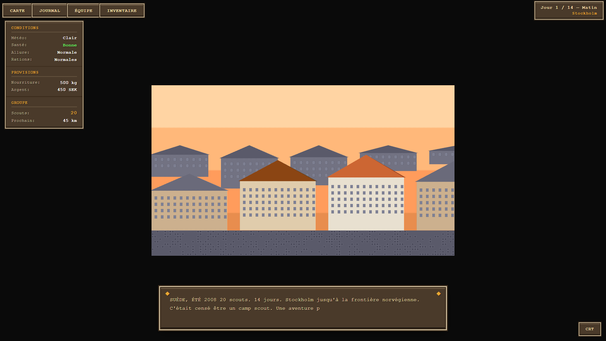
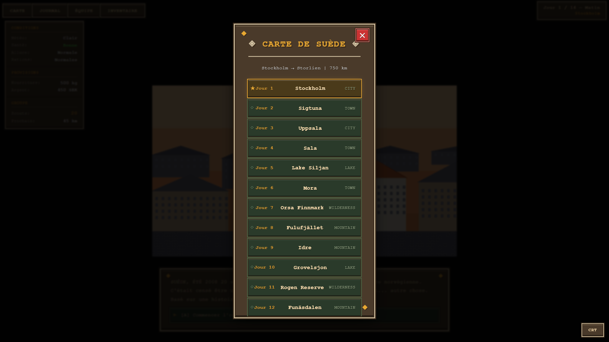
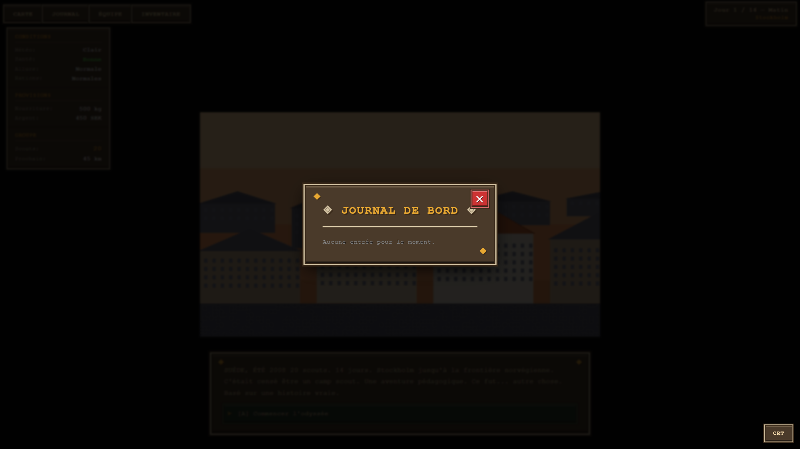
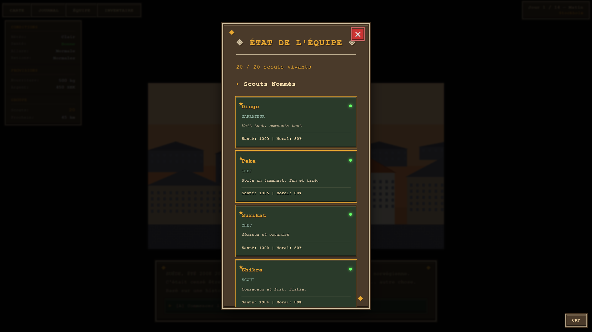
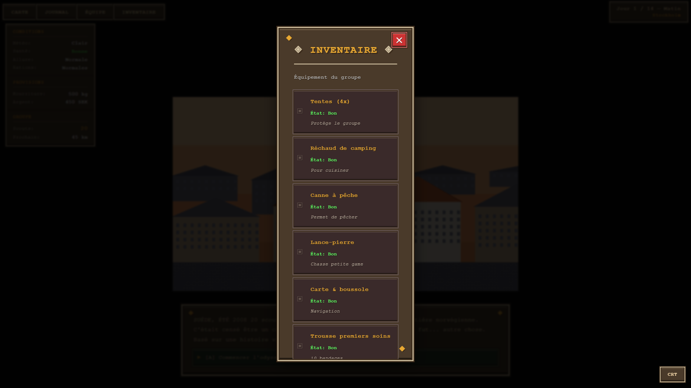
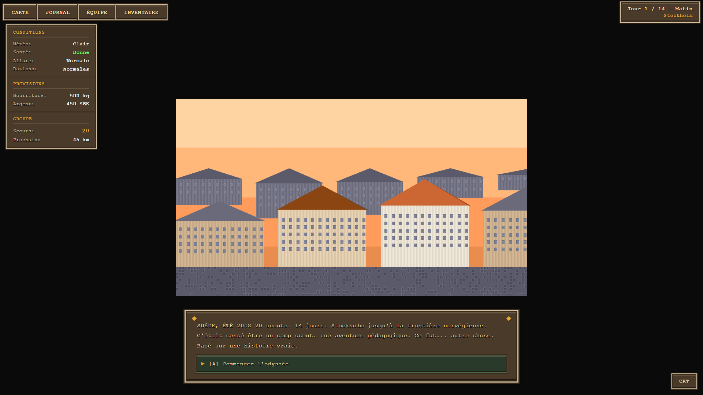
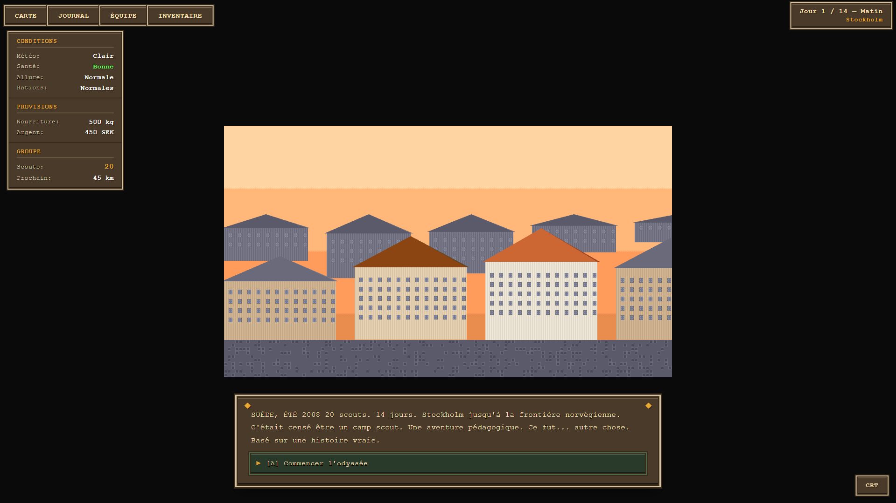

# 🎮 Sweden Odyssey - Autonomous Playthrough Report

**Generated:** 2026-02-13T16:57:11.536Z
**Playthrough Method:** Autonomous browser automation (Puppeteer)

---

## 📊 Summary

- **Game Started:** ✅ Yes
- **Days Reached:** 0
- **Scouts Remaining:** 20/20
- **Decisions Made:** 0
- **Screenshots Captured:** 17
- **Bugs Found:** 0
- **Game Completed:** ⏳ In Progress

## ✅ No Critical Bugs Found

The game played smoothly without major issues.

## 👁️ Observations

1. Game rendering correctly - city scene visible
2. Using UI-based observation instead of direct state access
3. Continue button not clickable
4. UI shows: Jour 1 / 14 — Matin
5. Event: SUÈDE, ÉTÉ 2008

20 scouts. 14 jours. Stockholm jusqu'à la frontière norvégienne.

C'était censé être un camp scout. Une aventure pédagogique.

Ce fut
6. UI shows: Jour 1 / 14 — Matin
7. Event: SUÈDE, ÉTÉ 2008

20 scouts. 14 jours. Stockholm jusqu'à la frontière norvégienne.

C'était censé être un camp scout. Une aventure pédagogique.

Ce fut
8. UI shows: Jour 1 / 14 — Matin
9. Event: SUÈDE, ÉTÉ 2008

20 scouts. 14 jours. Stockholm jusqu'à la frontière norvégienne.

C'était censé être un camp scout. Une aventure pédagogique.

Ce fut
10. UI shows: Jour 1 / 14 — Matin
11. Event: SUÈDE, ÉTÉ 2008

20 scouts. 14 jours. Stockholm jusqu'à la frontière norvégienne.

C'était censé être un camp scout. Une aventure pédagogique.

Ce fut
12. UI shows: Jour 1 / 14 — Matin
13. Event: SUÈDE, ÉTÉ 2008

20 scouts. 14 jours. Stockholm jusqu'à la frontière norvégienne.

C'était censé être un camp scout. Une aventure pédagogique.

Ce fut
14. UI shows: Jour 1 / 14 — Matin
15. Event: SUÈDE, ÉTÉ 2008

20 scouts. 14 jours. Stockholm jusqu'à la frontière norvégienne.

C'était censé être un camp scout. Une aventure pédagogique.

Ce fut
16. UI shows: Jour 1 / 14 — Matin
17. Event: SUÈDE, ÉTÉ 2008

20 scouts. 14 jours. Stockholm jusqu'à la frontière norvégienne.

C'était censé être un camp scout. Une aventure pédagogique.

Ce fut
18. UI shows: Jour 1 / 14 — Matin
19. Event: SUÈDE, ÉTÉ 2008

20 scouts. 14 jours. Stockholm jusqu'à la frontière norvégienne.

C'était censé être un camp scout. Une aventure pédagogique.

Ce fut
20. UI shows: Jour 1 / 14 — Matin
21. Event: SUÈDE, ÉTÉ 2008

20 scouts. 14 jours. Stockholm jusqu'à la frontière norvégienne.

C'était censé être un camp scout. Une aventure pédagogique.

Ce fut
22. UI shows: Jour 1 / 14 — Matin
23. Event: SUÈDE, ÉTÉ 2008

20 scouts. 14 jours. Stockholm jusqu'à la frontière norvégienne.

C'était censé être un camp scout. Une aventure pédagogique.

Ce fut

## 📸 Screenshots

Total captured: 17

### 1. game-loaded-initial-screen

---

### 2. intro-text

---

### 3. interaction-1

---

### 4. interaction-2

---

### 5. interaction-3

---

### 6. interaction-4

---

### 7. tab-map

---

### 8. tab-journal

---

### 9. tab-status

---

### 10. tab-inventory

---

### 11. interaction-5

---

### 12. interaction-6

---

### 13. interaction-7

---

### 14. interaction-8

---

### 15. interaction-9

---

### 16. interaction-10

---

### 17. final-state

---

## 💡 Recommendations

- ⚠️ **Limited Progress:** Only reached Day 0. Consider:
  - Simplifying initial tutorial
  - Clearer UI prompts
  - Better onboarding

---

**Review Location:** `game-playthrough-screenshots/`
**Next Steps:** Review screenshots and address any issues found.
