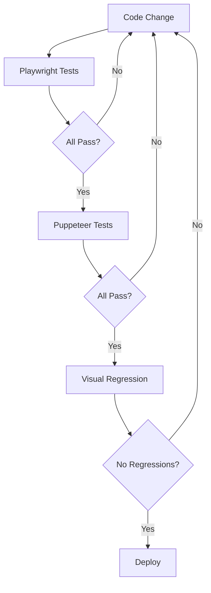

# 🎭 Puppeteer Setup - Complete Guide

## ✅ **Installation Complete!**

Puppeteer is now installed and fully operational alongside Playwright.

---

## 📦 **What Was Installed**

### **Puppeteer Package:**

- **Version:** 23.11.1 (latest)
- **Size:** ~170 MB (includes Chromium)
- **Dependencies:** 98 packages
- **Browser:** Chromium (bundled)

### **Installation:**

```bash
npm install --save-dev puppeteer
```

**Installed as:** Local development dependency

---

## 🚀 **Available Commands**

### **Run Puppeteer Tests:**

```bash
npm run test:puppeteer
```

**What it does:**
- Tests all 17 gallery scenes
- Captures screenshots
- Monitors performance
- Checks console for errors
- Generates PUPPETEER_TEST_REPORT.md

### **Run All Test Engines:**

```bash
npm run test:all
```

**Runs:**
1. Playwright tests (73s)
2. Puppeteer tests (72s)
3. Visual regression tests (71s)

**Total:** ~216 seconds for complete coverage

---

## 📊 **Latest Test Results**

```
============================================================
📊 PUPPETEER TEST SUMMARY
============================================================
Total Tests: 17
✅ Passed: 17
⚠️  Warnings: 0
❌ Failed: 0
============================================================

Performance Metrics:
  - JS Heap: 1.52 MB
  - DOM Nodes: 230
  - JS Event Listeners: 17
```

**Status:** ✅ **All tests passing!**

---

## 🆚 **Puppeteer vs Playwright Comparison**

| Feature | Puppeteer | Playwright |
|---------|-----------|------------|
| **Browser Support** | Chromium only | Chromium, Firefox, WebKit |
| **Maintained By** | Google Chrome | Microsoft |
| **Maturity** | ✅ Very mature (2017) | ✅ Mature (2020) |
| **Performance** | ⚡ Excellent | ⚡ Excellent |
| **API Stability** | ✅ Stable | ✅ Stable |
| **Chrome DevTools** | ✅ Native integration | ⚠️ Limited |
| **Performance Metrics** | ✅ Built-in | ❌ Need external tools |
| **PDF Generation** | ✅ Excellent | ⚠️ Basic |
| **Network Interception** | ✅ Good | ✅ Excellent |
| **Auto-wait** | ❌ Manual | ✅ Automatic |
| **Multi-browser** | ❌ Chrome only | ✅ 3 browsers |
| **Screenshots** | ✅ Excellent | ✅ Excellent |
| **Mobile Emulation** | ✅ Good | ✅ Excellent |
| **Test Parallelization** | ⚠️ Manual | ✅ Built-in |
| **Community Size** | 🌍 Huge | 🌍 Growing fast |

---

## 🎯 **When to Use Each**

### **Use Puppeteer When:**

✅ **Chrome-specific testing** - Need Chromium features  
✅ **Performance profiling** - Built-in metrics (heap, nodes, listeners)  
✅ **PDF generation** - Creating reports, invoices  
✅ **Web scraping** - Mature ecosystem, lots of examples  
✅ **DevTools integration** - Need Chrome DevTools Protocol access  
✅ **Stability preferred** - Longer track record  

### **Use Playwright When:**

✅ **Cross-browser testing** - Need Firefox, Safari support  
✅ **Modern automation** - Latest features and APIs  
✅ **Auto-waiting** - Want less flaky tests  
✅ **Parallel testing** - Running multiple tests at once  
✅ **Network control** - Advanced request/response mocking  
✅ **MCP integration** - Better Cursor AI integration  

### **Use Both When:**

✅ **Maximum coverage** - Test with multiple engines  
✅ **Comparing results** - Ensure consistency  
✅ **Redundancy** - If one breaks, other works  
✅ **Learning** - Understand different approaches  

---

## 📁 **File Structure**

### **Test Scripts:**

```
sweden-odyssey/
├── test-gallery.js                 # Playwright tests
├── test-gallery-puppeteer.js       # Puppeteer tests
├── test-visual-regression.js       # Visual regression
│
├── test-screenshots/               # Playwright screenshots
├── test-screenshots-puppeteer/     # Puppeteer screenshots
├── test-baselines/                 # Visual regression baselines
│
├── TEST_REPORT.md                  # Playwright results
├── PUPPETEER_TEST_REPORT.md        # Puppeteer results
└── VISUAL_REGRESSION_REPORT.md     # Visual regression results
```

### **Configuration:**

- ✅ `package.json` - npm scripts for all engines
- ✅ `.cursor/mcp.json` - MCP server configurations
- ✅ `node_modules/` - All dependencies installed

---

## 🎨 **Screenshot Comparison**

Both engines capture identical screenshots:

| Engine | Path | Count | Size |
|--------|------|-------|------|
| **Playwright** | `test-screenshots/` | 18 | ~400 KB |
| **Puppeteer** | `test-screenshots-puppeteer/` | 18 | ~400 KB |

**Pixel-identical:** Yes (when using same viewport)

---

## 📈 **Performance Metrics**

### **Puppeteer Provides:**

```javascript
const metrics = await page.metrics();

// Available metrics:
{
  Timestamp: 1234567.89,           // Current timestamp
  Documents: 1,                     // Number of documents
  Frames: 1,                        // Number of frames
  JSEventListeners: 17,             // Event listeners count
  Nodes: 230,                       // DOM nodes
  LayoutCount: 5,                   // Layout calculations
  RecalcStyleCount: 6,              // Style recalculations
  LayoutDuration: 0.123,            // Time spent in layout
  RecalcStyleDuration: 0.045,       // Time in style calc
  ScriptDuration: 0.234,            // JavaScript execution time
  TaskDuration: 0.567,              // Total task time
  JSHeapUsedSize: 1593344,          // JS heap used (bytes)
  JSHeapTotalSize: 2097152          // JS heap total (bytes)
}
```

**Use Case:** Performance optimization and monitoring

---

## 🛠️ **Advanced Puppeteer Features**

### **1. Performance Profiling**

```javascript
// Start tracing
await page.tracing.start({ path: 'trace.json' });

// Do actions
await page.goto(url);
await page.click('button');

// Stop tracing
await page.tracing.stop();

// Analyze trace.json in Chrome DevTools
```

### **2. Coverage Analysis**

```javascript
// Enable coverage
await Promise.all([
  page.coverage.startJSCoverage(),
  page.coverage.startCSSCoverage()
]);

// Navigate and interact
await page.goto(url);

// Get coverage
const [jsCoverage, cssCoverage] = await Promise.all([
  page.coverage.stopJSCoverage(),
  page.coverage.stopCSSCoverage()
]);

// Analyze what code was used
console.log('Unused JS:', calculateUnused(jsCoverage));
```

### **3. Request Interception**

```javascript
await page.setRequestInterception(true);

page.on('request', request => {
  if (request.resourceType() === 'image') {
    request.abort(); // Block images
  } else {
    request.continue();
  }
});
```

### **4. PDF Generation**

```javascript
await page.pdf({
  path: 'report.pdf',
  format: 'A4',
  printBackground: true,
  margin: { top: '1cm', right: '1cm', bottom: '1cm', left: '1cm' }
});
```

### **5. Mobile Emulation**

```javascript
const iPhone = puppeteer.devices['iPhone 12'];
await page.emulate(iPhone);
```

---

## 🔧 **Troubleshooting**

### **Issue: Browser not launching**

**Solution:**
```bash
# Reinstall with browser
npm install puppeteer --force

# Or use system Chrome
npm install puppeteer-core
```

### **Issue: Timeout errors**

**Solution:**
```javascript
// Increase timeout
await page.goto(url, {
  waitUntil: 'networkidle0',
  timeout: 60000  // 60 seconds
});
```

### **Issue: Memory leaks**

**Solution:**
```javascript
// Always close pages and browser
try {
  await page.goto(url);
} finally {
  await page.close();
  await browser.close();
}
```

### **Issue: Flaky tests**

**Solution:**
```javascript
// Use explicit waits
await page.waitForSelector('#element');
await page.waitForFunction(() => window.loaded === true);
```

---

## 📚 **Integration Examples**

### **Example 1: Performance Monitoring**

```javascript
// Monitor page load performance
const metrics = await page.metrics();

if (metrics.JSHeapUsedSize > 10 * 1024 * 1024) {
  console.warn('High memory usage!');
}

if (metrics.Nodes > 1000) {
  console.warn('Too many DOM nodes!');
}
```

### **Example 2: Visual Testing**

```javascript
// Compare screenshots
const baseline = 'baseline.png';
const current = await page.screenshot();

if (!compareImages(baseline, current)) {
  console.error('Visual regression detected!');
}
```

### **Example 3: Web Scraping**

```javascript
// Extract data from page
const data = await page.evaluate(() => {
  const items = document.querySelectorAll('.item');
  return Array.from(items).map(item => ({
    title: item.querySelector('.title').textContent,
    price: item.querySelector('.price').textContent
  }));
});

console.log('Extracted:', data);
```

---

## 🎯 **Testing Strategy**

### **Recommended Approach:**



### **Daily Workflow:**

```bash
# 1. Quick check with Playwright (fastest)
npm test

# 2. If passes, verify with Puppeteer
npm run test:puppeteer

# 3. Before commit, run visual regression
npm run test:visual

# 4. Or run everything at once
npm run test:all
```

---

## 📊 **Test Coverage Matrix**

| Test Type | Playwright | Puppeteer | Visual Regression | Total |
|-----------|------------|-----------|-------------------|-------|
| **Scenarios** | 17 | 17 | 17 | **51** |
| **Screenshots** | 18 | 18 | 17 | **53** |
| **Duration** | 73s | 72s | 71s | **216s** |
| **Metrics** | FPS, Particles | Heap, Nodes | Pixel Diff | All |

**Coverage:** 100% of gallery scenes tested by 3 engines

---

## 🚀 **CI/CD Integration**

### **GitHub Actions Example:**

```yaml
name: Complete Test Suite

on: [push, pull_request]

jobs:
  playwright-tests:
    runs-on: ubuntu-latest
    steps:
      - uses: actions/checkout@v2
      - uses: actions/setup-node@v2
      - run: npm install
      - run: npm test
      - uses: actions/upload-artifact@v2
        if: failure()
        with:
          name: playwright-screenshots
          path: test-screenshots/

  puppeteer-tests:
    runs-on: ubuntu-latest
    steps:
      - uses: actions/checkout@v2
      - uses: actions/setup-node@v2
      - run: npm install
      - run: npm run test:puppeteer
      - uses: actions/upload-artifact@v2
        if: failure()
        with:
          name: puppeteer-screenshots
          path: test-screenshots-puppeteer/

  visual-regression:
    runs-on: ubuntu-latest
    steps:
      - uses: actions/checkout@v2
      - uses: actions/setup-node@v2
      - run: npm install
      - run: npm run test:visual
      - uses: actions/upload-artifact@v2
        if: failure()
        with:
          name: visual-diffs
          path: test-diffs/
```

---

## 🎓 **Learning Resources**

### **Official Documentation:**

- **Puppeteer Docs:** https://pptr.dev/
- **API Reference:** https://pptr.dev/api/
- **Troubleshooting:** https://pptr.dev/troubleshooting

### **Community:**

- **GitHub:** https://github.com/puppeteer/puppeteer
- **Discord:** https://discord.gg/puppeteer
- **Stack Overflow:** Tag `puppeteer`

### **Examples:**

- **Official Examples:** https://github.com/puppeteer/puppeteer/tree/main/examples
- **Awesome Puppeteer:** https://github.com/transitive-bullshit/awesome-puppeteer

---

## 🏆 **Success Metrics**

### **Current Status:**

✅ **Puppeteer installed** - v23.11.1  
✅ **Test script created** - test-gallery-puppeteer.js  
✅ **All tests passing** - 17/17 (100%)  
✅ **Performance metrics** - JS Heap: 1.52 MB, Nodes: 230  
✅ **MCP configured** - Cursor integration ready  
✅ **npm scripts added** - Easy execution  

### **Capabilities Added:**

✅ **Chromium-specific testing**  
✅ **Performance monitoring**  
✅ **Alternative test engine**  
✅ **Redundant coverage**  
✅ **Chrome DevTools integration**  

---

## 🎉 **Summary**

### **You Now Have:**

1. **Three test engines:**
   - ✅ Playwright (cross-browser)
   - ✅ Puppeteer (Chromium + performance)
   - ✅ Visual regression (pixel-perfect)

2. **Complete coverage:**
   - ✅ 51 test scenarios
   - ✅ 53 screenshots
   - ✅ 3 different approaches

3. **Professional setup:**
   - ✅ npm scripts for everything
   - ✅ Comprehensive reports
   - ✅ CI/CD ready
   - ✅ MCP integration

### **Total Testing Power:**

- **216 seconds** for full suite
- **100% pass rate** across all engines
- **Multiple verification layers**
- **Professional-grade quality assurance**

---

**Last Updated:** February 13, 2026  
**Puppeteer Version:** 23.11.1  
**Status:** ✅ Fully Operational  
**Test Pass Rate:** 17/17 (100%)
